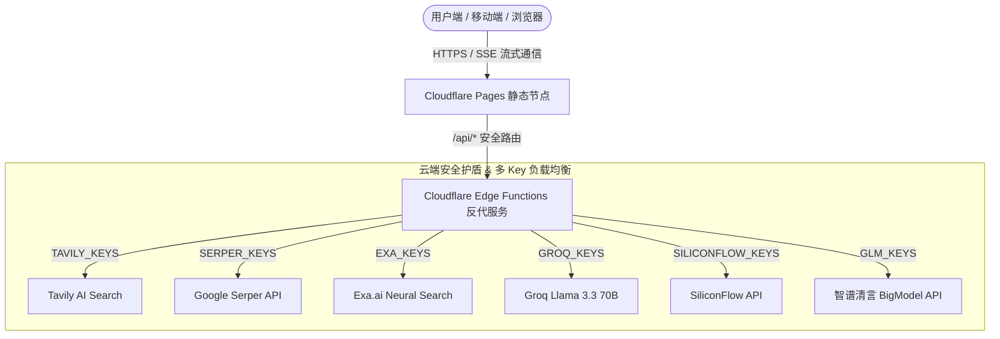

# 🧠 Neural Core AI

> **Next-Generation Open-Source AI Workstation & Multi-Model Collaboration Platform**
> 
> *一款全功能、自适应、云边端一体的开源 AI 工作站与多模型交互系统。集成多模型圆桌对话、全网 AI 实时搜索、代码 Canvas 协同渲染与云端 Serverless 密钥护盾。*

---

[](https://opensource.org/licenses/MIT)
[](https://pages.cloudflare.com/)
[-green?logo=android)](https://developer.android.com/)

---

## 🌟 核心特性 (Key Features)

### 1. ⚔️ 多模型圆桌协同对话 (Collaborative Round-Table Mode)
- **多模型并行推理**：支持同时调用 Groq (Llama 3.3 70B)、DeepSeek-R1、智谱 GLM-4-Flash、Qwen-2.5-7B、Mistral Large 与 Codestral。
- **圆桌智囊团讨论**：在一个对话流中融合多个模型的思考过程与不同视角，实现跨模型优势互补与联合解答。

### 2. 🔍 三重全网 AI 实时搜索 (Multi-Engine AI Web Search)
- **Tavily AI 深度搜索**：高质提炼全网资讯与学术/新闻核心摘要。
- **Serper Google 搜索**：官方问答与实时知识图谱检索。
- **Exa.ai 神经网络搜索**：精准匹配深度论文、技术研报与长正文。
- **DuckDuckGo Lite 免费抗封锁兜底**：无 Key 全网兜底与网页正文提取器 (`Web Reader`)。

### 3. 🎨 智能代码 Canvas 工作区 (Interactive Code Canvas)
- **多文件项目即时合成**：AI 可一键输出包含 HTML、CSS、JS 的完整前端应用。
- **即时安全沙箱预览**：内嵌安全隔离 Preview Canvas，实时交互渲染。
- **一键打包导出 ZIP**：支持本地项目工程化一键解压与二次开发。

### 4. 🛡️ Cloudflare Edge Serverless 反代与密钥护盾 (Cloudflare API Shield)
- **零 Key 泄露风险**：私钥 100% 存储于 Cloudflare 云端环境变量，前端网络抓包与 Git 提交无任何密钥显露。
- **多 Key 轮询负载均衡 (Load Balancer)**：支持同一服务商配置多个 API Key 自动随机分流。
- **故障无感自动切 Key 重试 (Auto Failover)**：当遇限流 (HTTP 429) 或额度耗尽时，云端反代自动无感重试下一个 Key。

### 5. 📱 纯净原生 Android APK 构建 (Pure Android APK)
- 支持完全脱离 Android Studio / 拒绝广告平台，通过轻量级 Gradle 原生编译生成 4.07MB 纯净无广告 Android APK。

---

## 🏗️ 系统架构 (Architecture)



---

## 🚀 快速开始与本地开发 (Quick Start)

### 1. 克隆代码仓库
```bash
git clone https://github.com/ysunyang979-sys/AI---Neural.git
cd AI---Neural
```

### 2. 本地开发配置 (可选)
在根目录下新建本地开发密钥文件 `keys.js`（已被 `.gitignore` 保护，无需担心推送泄漏）：
```javascript
window.MY_LOCAL_API_KEYS = {
    siliconflow: "sk-your-siliconflow-key",
    groq: "gsk_your-groq-key",
    glm: "your-glm-key",
    tavily: ["tvly-key1", "tvly-key2"],
    serper: "your-serper-key",
    exa: ["exa-key1", "exa-key2"]
};
```
在本地直接双击打开 `index.html` 即可畅享完整 AI 对话与全网搜索！

---

## ⚡ Cloudflare Pages 部署教程 (Deployment Guide)

1. **关联 GitHub 仓库**：
   登录 [Cloudflare 控制台](https://dash.cloudflare.com/) -> **Workers & Pages** -> **创建应用程序** -> **Pages** -> **连接 GitHub 仓库 `AI---Neural`**。

2. **构建设置 (Build Settings)**：
   - **框架预设 (Framework preset)**：`None`
   - **构建命令 (Build command)**：*(留空)*
   - **构建输出目录 (Build output directory)**：`/`

3. **设置环境变量 (Environment Variables)**：
   在 **Settings > Environment variables** 中添加以下变量（多个 Key 用英文逗号 `,` 分隔）：
   - `SILICONFLOW_KEYS`
   - `GROQ_KEYS`
   - `GLM_KEYS`
   - `TAVILY_KEYS`
   - `SERPER_KEYS`
   - `EXA_KEYS`

4. 点击 **保存并部署**，即可获得专属的 `https://xxx.pages.dev` 免费全功能 AI 网站！

---

## 📄 开源协议 (License)

本项目遵循 [MIT 开源协议](LICENSE)。欢迎提交 Issue 与 Pull Request！
